# 实验报告

*18342058* 刘泓泽 *18342128* 张心悦

## 项目背景
基于已有的开源区块链系统FISCO-BCOS，以联盟链为主，开发基于区块链或区块链智能合约的供应链金融平台，实现供应链应收账款资产的溯源、流转。   
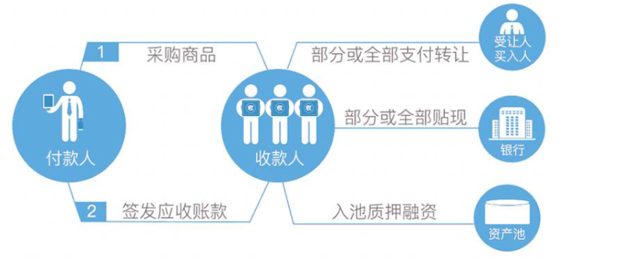     

## 项目要求
1. 功能一：实现采购商品—签发应收账款交易上链。例如车企从轮胎公司购买一批轮胎并签订应收账款单据。
2. 功能二：实现应收账款的转让上链，轮胎公司从轮毂公司购买一笔轮毂，便将于车企的应收账款单据部分转让给轮毂公司。轮毂公司可以利用这个新的单据去融资或者要求车企到期时归还钱款。
3. 功能三：利用应收账款向银行融资上链，供应链上所有可以利用应收账款单据向银行申请融资。
4. 功能四：应收账款支付结算上链，应收账款单据到期时核心企业向下游企业支付相应的欠款。

## 项目设计
#### 总体要求：
    根据作业要求，将供应链上的每一笔交易和应收账款单据上链，同时引入第三方可信机构来确认这些信息的交易，例如银行，物流公司等，确保交易和单据的真实性。同时，支持应收账款的转让，融资，清算等，让核心企业的信用可以传递到供应链的下游企业，减小中小企业的融资难度。
#### 方案设计：
   将企业的应收账款单据存储在通过 FISCO BCOS 部署的四节点联盟链上。我们需要解决的是供应链上下游的信息不对等而导致的融资难问题，当两个企业签订了应收账款单据后，将它们的公司信息、应收数目上链，在必要时，企业间的应收账款可以转移到第三方，比如题目例子中轮胎公司可以将宝马公司的 500 万应收账款单据转移给轮毂公司。  
   总交易流程图绘制如下：  
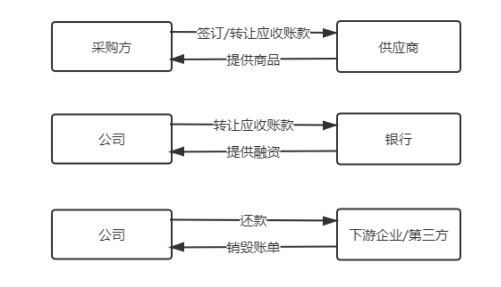    
#### 数据结构设计：
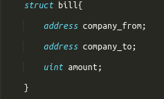   
 bill结构体存储了每一笔应收账款单据的详细信息    
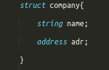     
company结构体存储了每个公司的名称以及地址，并通过映射记录公司的应收账款总额。
该设计的巧妙之处在于公司的结构体内不含有关欠款金额等的信息，可以提高空间的利用率。    
#### 功能实现设计：
智能合约的核心设计如下：  
1. 功能一:实现采购商品—签发应收账款 交易上链。例如车企从轮胎公司购买一批轮胎并签订应收账款单据。      
   ​		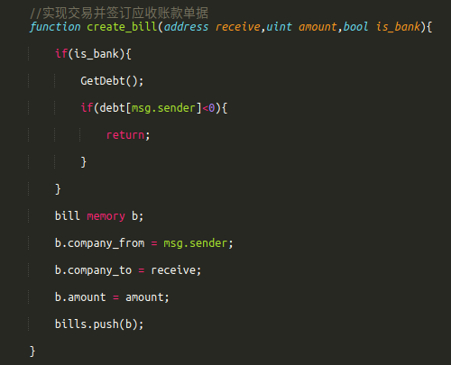  

2. 功能二：实现应收账款的转让上链，轮胎公司从轮毂公司购买一笔轮毂，便将于车企的应收账款单据部分转让给轮毂公司。轮毂公司可以利用这个新的单据去融资或者要求车企到期时归还钱款。   
   ​	   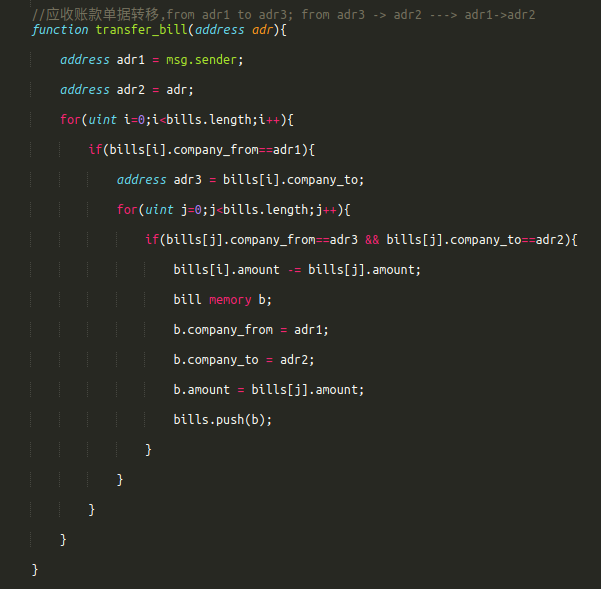

3. 功能三：利用应收账款向银行融资上链，供应链上所有可以利用应收账款单据向银行申请融资。    
   ​		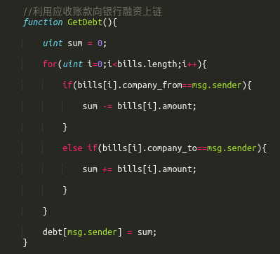 

4. 功能四：应收账款支付结算上链，应收账款单据到期时核心企业向下游企业支付相应的欠款。   
   ​			 

## 功能测试

使用WeBase可视化平台实现功能的测试：

#### 添加用户并部署合约

​		在webase-web 上的私钥管理中添加四个用户:普通企业用户car、steel、hub分别表示汽车企业，轮胎公司，轮毂公司；Bank表示第三方权威机构 。

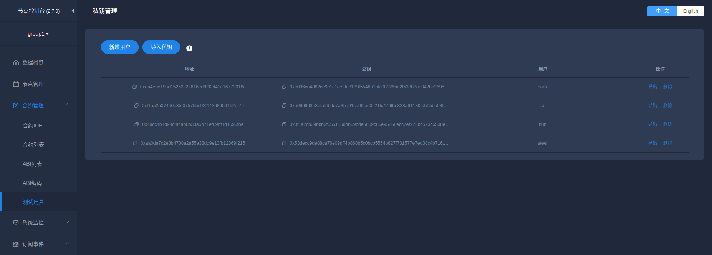

​		在合约IDE界面，将编译好的合约部署到用户bank上。

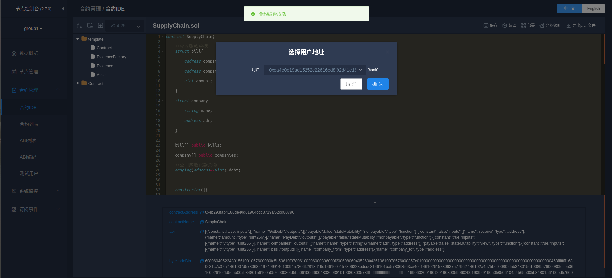

#### 功能测试：

**验证功能1**：**实现采购商品—签发应收账款交易上链**

​		调用 create_bill 来创建 车企car 欠下轮胎公司steel 2000 资金的应收账款单据(实际应用中，车企和轮胎公司的资金无变化）

​		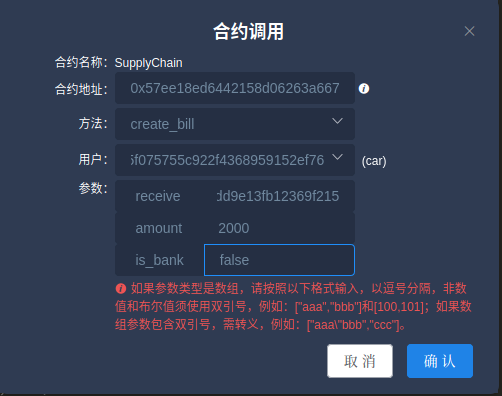 

​		显示如下，说明创建成功。

​		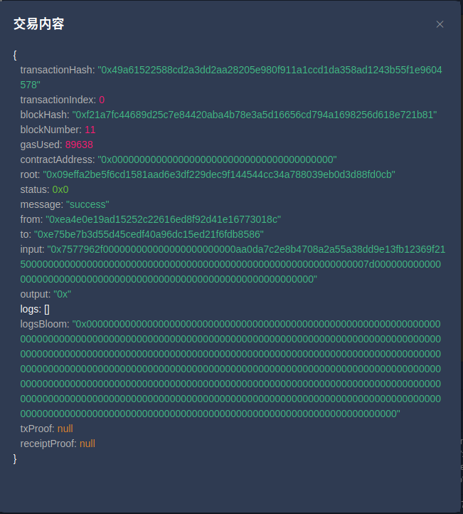	 

​		调用辅助函数GetBill()，查看轮胎公司steel的应收账款总额

​		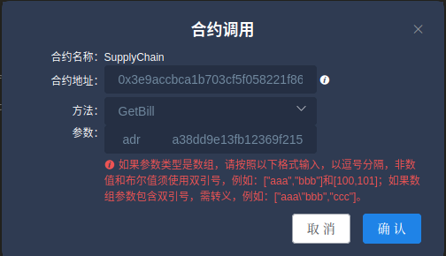  

​		可以看到结果显示为2000，功能一验证成功。

​		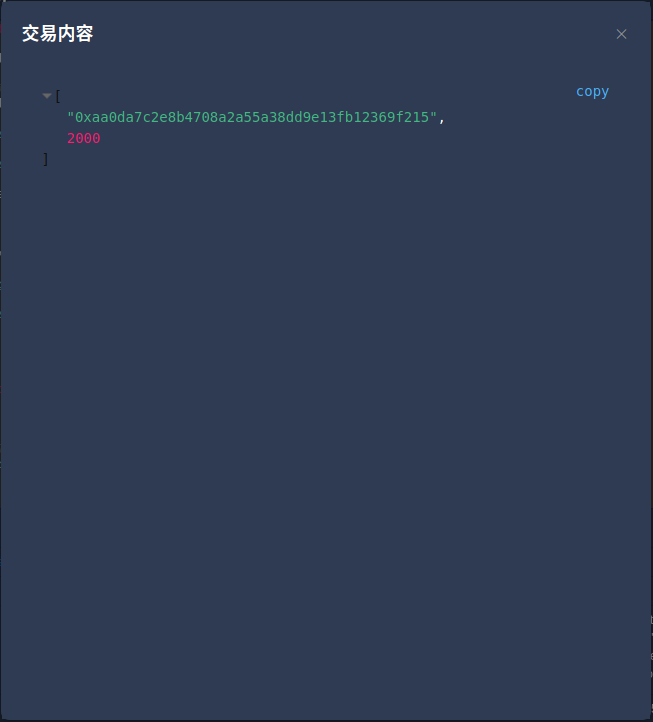 

**验证功能二**:**实现应收账款的转让上链**

​		首先通过功能一，创建轮胎公司欠轮毂公司1000资金的应收账款单据，结果如下：

​		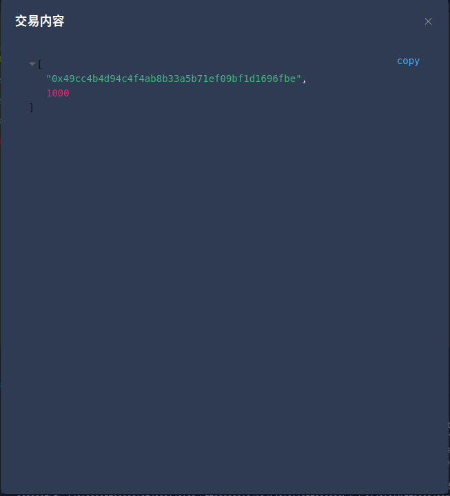 

​		然后调用 transfer_bill，将轮胎公司欠轮毂公司1000资金的应收账款单据转移到车企上，即功能二实现后车企欠轮胎公司资金1000，同时车企欠轮毂公司资金1000，轮胎公司不再欠轮毂公司资金。

​		 

​		最后，查询轮胎公司和轮毂公司的应收账款单据，结果如下：

​		轮胎公司：

​		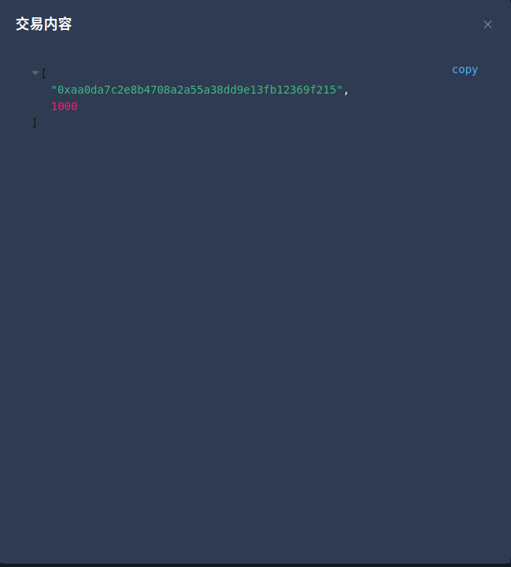 

​		轮毂公司：

​		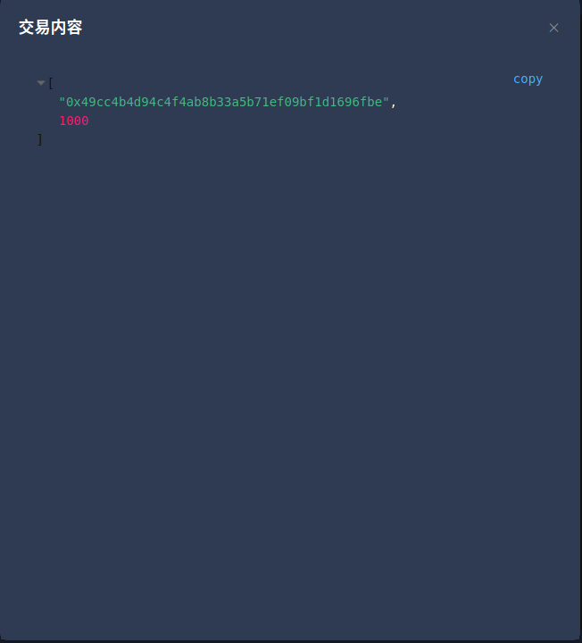	 

​		此时轮胎公司的应收账款单据已经由2000变为1000，功能二实现。

**验证功能三**: **利用应收账款向银行融资上链**

​		首先调用GetBill函数查看轮毂公司的总应收账款，结果如下：

​		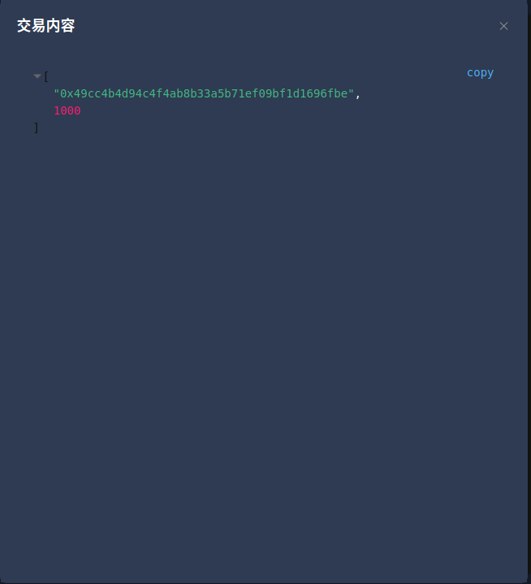 

​		然后调用函数GetDebt，获取轮毂公司的总应收账款，实现向银行申请融资。

​		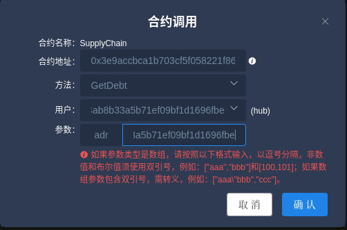		 

​		显示如下，证明功能三的融资上链成功。

​		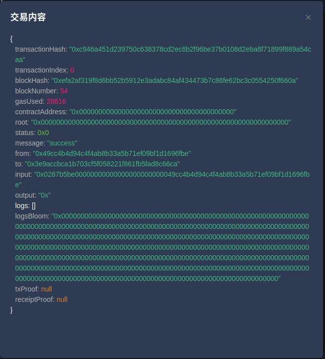 

**验证功能4：应收账款支付结算上链**

​		通过调用函数PayDebt实现车企向轮胎公司偿还应收账款500资金

​		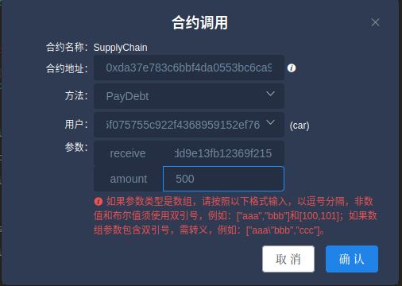 

​		结果如下：

​		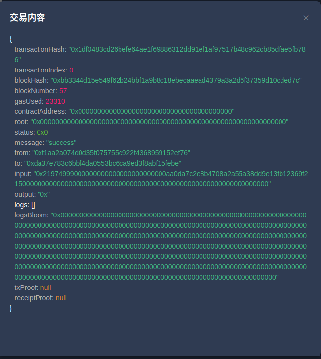 

​		然后调用辅助函数GetBill查询轮胎公司的应收账款总额，结果为500，证明车企已向轮胎公司偿还应收账款500资金，功能四验证成功。

​		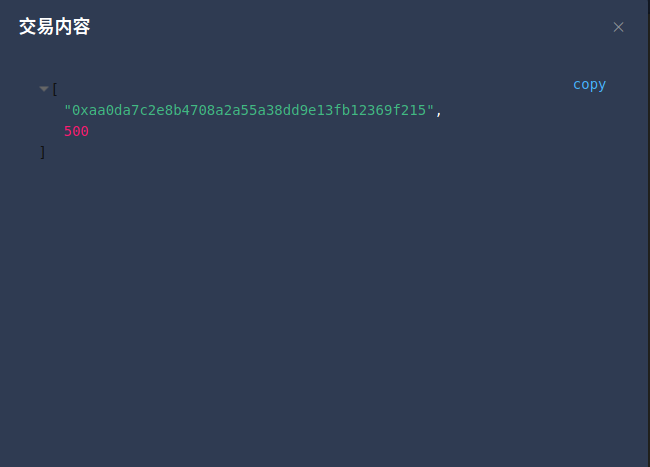
